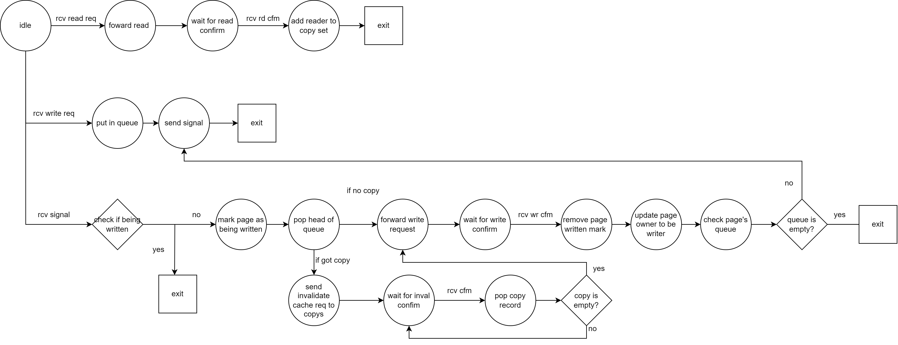
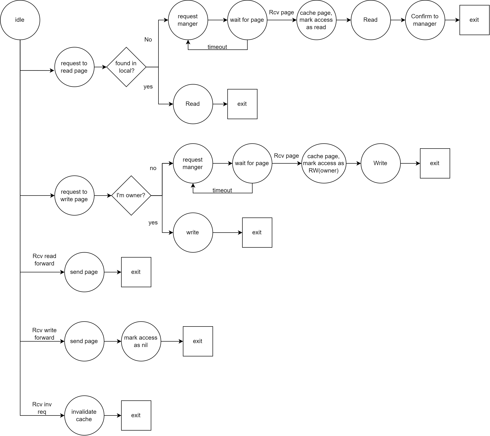

# Go Assignment 3
50.041 Distributed Systems and Computing Go Assignment 3  
Name: Guo Yuchen  
Student ID: 1004885  

# Question 1&2
`vanilaIvy`: Basic verison of Ivy  
`fautTolerantIvy`: Fault tolerance verison of Ivy   

## Compilation
To build:
```
go build vanilaIvy.go server.go record.go PriorityQueue.go  page.go message.go manager.go logger.go
go build fautTolerantIvy.go server.go record.go PriorityQueue.go  page.go message.go manager.go logger.go
```

To execute：
```
./vanilaIvy.exe -servers=? -requests=? 
./fautTolerantIvy.exe -servers=? -requests=? -faults=? -rejoin=? -fail_backup=?
```  
- `-servers`: `int`, indicates the number of clients.  
- `-requests`: `int`, indicates number of requests that each server will make. write and read will be simulated alternatively.
- `faults`: `int`, indicates number of times that the primary fails
- `rejoin`: `bool`, indicates whether primary rejoins after fails
- `fail_backup`: `bool`, indicates whether the backup manager fails as well as the primary

## External package
`log` : used for output logging and debugging purpose.   
`container/heap`: used to construct priority queue.  

## Implementation
1. Manager holds a priority queue, write requests will be stored in queue and executed sequentially. Request with earlier timestamp or higher server id are prioritised.
2. The following state diagrams shows the workflow of the primary CM and server under fault-free condition.


3. To detects faults of the CMs, heartbeat is initiated by primary CM, and the backup CM will reply when it gets the heartbeat message. If there's no heartbeat messgage from primary after a certain period of time, the backup will take control and announce it to all servers. Then when primary rejoin, the backup will notice and transfer the control back, update the primary's record and clock, and announce it to all servers. 
4. The primary CM will sync data with the backup CM everytime a change to the data is made, which ensures the data consistency.
5. When a CM is down, it marks itself's `is_alive` as false, clear the records, reset the clock, and stops sending heartbeat and processing incoming messages.
6. Termination condition: There's no any incoming message for all channels for `timeout` time long. 
7. Records initiation: initially, every server is owner of one page, the page number of it is its own id.

## Output interpretation
The logger will log the information in `logs.txt` file in the folder, and the performance information will be stored in `performance_log.txt`.

### Sample outputs
#### Basic version
3 servers, 3 read reuqests, 3 write requests
```log
13:14:53 server.go:90: Server 0 wants to write page 0...
13:14:53 server.go:95: Server 0 is writing page 0 at clock 0
13:14:53 server.go:96: Server 0 finished writing page 0.
13:14:53 server.go:73: Server 0 wants to read page 1...
13:14:53 server.go:84: Server 0 request to read page 1 to manager at clock 0.
13:14:53 manager.go:41: Manager received Server 0's read request at clock 0.
13:14:53 manager.go:115: Manager forward READ request for page 1 at clock 2.
13:14:53 server.go:40: Server 1 received Manager's read forward at clock 2.
13:14:53 server.go:115: Server 1 sent page 1 to Server 0 at clock 4.
13:14:53 server.go:55: Server 0 received Server 1's sent page at clock 4.
13:14:53 server.go:154: Server 0 is reading page 1...
13:14:53 server.go:129: Server 0 sent READ confirm for page 1 to manager at clock 6.
13:14:53 manager.go:50: Manager received Server 0's read confirm at clock 6.
13:14:53 manager.go:228: Manager adds server 0 to page 1's copyset.
13:14:54 server.go:90: Server 1 wants to write page 0...
13:14:54 server.go:101: Server 1 request to write page 0 to manager at clock 4.
13:14:54 manager.go:46: Manager received Server 1's write request at clock 4.
13:14:54 manager.go:159: Manager pushed server 1's wr req for page 0 at clock 8.
13:14:54 manager.go:74: Signal channel received msg  {-1 -1 0 NOTICE_WRITE_REQUEST 4 {0 <nil>} 1}  at clock  9
13:14:54 manager.go:80: record.writing is  false  at clock  9
13:14:54 manager.go:86: Manager poped s1's wr req for page 0.
13:14:54 manager.go:115: Manager forward WRITE request for page 0 at clock 10.
13:14:54 server.go:45: Server 0 received Manager's write forward at clock 10.
13:14:54 server.go:115: Server 0 sent page 0 to Server 1 at clock 12.
13:14:54 server.go:172: Server 1 is writing page 0 at clock 13.
13:14:54 server.go:129: Server 1 sent WRITE confirm for page 0 to manager at clock 14.
13:14:54 manager.go:54: Manager received Server 1's write confirm at clock 14.
13:14:54 server.go:60: Server 1 received Server 0's sent page at clock 12.
13:14:54 server.go:199: Server 0 remove access to page 0.
13:14:54 server.go:199: Server 0 remove access to page 0.
13:14:54 server.go:73: Server 1 wants to read page 1...
13:14:54 server.go:78: Server 1 is reading page 1 at clock 14
13:14:54 server.go:79: Server 1 finished reading page 1.
13:14:55 server.go:90: Server 2 wants to write page 0...
13:14:55 server.go:101: Server 2 request to write page 0 to manager at clock 0.
13:14:55 manager.go:46: Manager received Server 2's write request at clock 0.
13:14:55 manager.go:159: Manager pushed server 2's wr req for page 0 at clock 16.
13:14:55 manager.go:74: Signal channel received msg  {-1 -1 0 NOTICE_WRITE_REQUEST 0 {0 <nil>} 2}  at clock  17
13:14:55 manager.go:80: record.writing is  false  at clock  17
13:14:55 manager.go:86: Manager poped s2's wr req for page 0.
13:14:55 manager.go:115: Manager forward WRITE request for page 0 at clock 18.
13:14:55 server.go:115: Server 1 sent page 0 to Server 2 at clock 20.
13:14:55 server.go:45: Server 1 received Manager's write forward at clock 18.
13:14:55 server.go:172: Server 2 is writing page 0 at clock 21.
13:14:55 server.go:129: Server 2 sent WRITE confirm for page 0 to manager at clock 22.
13:14:55 server.go:199: Server 1 remove access to page 0.
13:14:55 server.go:60: Server 2 received Server 1's sent page at clock 20.
13:14:55 manager.go:54: Manager received Server 2's write confirm at clock 22.
13:14:55 server.go:73: Server 2 wants to read page 1...
13:14:55 server.go:84: Server 2 request to read page 1 to manager at clock 22.
13:14:55 manager.go:41: Manager received Server 2's read request at clock 22.
13:14:55 manager.go:115: Manager forward READ request for page 1 at clock 25.
13:14:55 server.go:40: Server 1 received Manager's read forward at clock 25.
13:14:55 server.go:115: Server 1 sent page 1 to Server 2 at clock 27.
13:14:55 server.go:55: Server 2 received Server 1's sent page at clock 27.
13:14:55 server.go:154: Server 2 is reading page 1...
13:14:55 server.go:129: Server 2 sent READ confirm for page 1 to manager at clock 29.
13:14:55 manager.go:50: Manager received Server 2's read confirm at clock 29.
13:14:55 manager.go:228: Manager adds server 2 to page 1's copyset.
13:15:25 vanilaIvy.go:88: Elapsed time:  2.5580574s
```

#### Fault tolerant version
10 severs, 8 requests, primary down once and rejoin once
```log
17:14:07 manager.go:237: Manager -2 received heartbeat from -1 at clock 0.
17:14:07 manager.go:134: Manager -1 sent heartbeat to -2 at clock 2.
17:14:07 server.go:32: Server 7 started listening...
17:14:07 manager.go:237: Manager -1 received heartbeat from -2 at clock 2.
17:14:08 manager.go:134: Manager -1 sent heartbeat to -2 at clock 4.
17:14:08 manager.go:237: Manager -2 received heartbeat from -1 at clock 1.
17:14:08 manager.go:237: Manager -1 received heartbeat from -2 at clock 4.
17:14:08 server.go:93: Server 0 wants to read page 3...
17:14:08 server.go:104: Server 0 request to read page 3 to manager -1 at clock 1.
17:14:08 server.go:77: Server 0 resends request to manager -1 at clock 1.
17:14:08 manager.go:53: Manager -1 received Server 0's message at clock 1.
17:14:08 manager.go:61: Manager -1 received Server 0's read request at clock 1.
17:14:08 manager.go:205: Manager -1 forward READ request for page 3 at clock 6.
17:14:08 server.go:43: Server 3 received Manager -1's read forward at clock 6.
17:14:08 server.go:58: Server 0 received Server 3's sent page at clock 8.
17:14:08 server.go:141: Server 3 sent page 3 to Server 0 at clock 8.
17:14:08 server.go:180: Server 0 is reading page 3...
17:14:08 server.go:155: Server 0 sent READ confirm for page 3 to manager -1 at clock 10.
17:14:08 manager.go:53: Manager -1 received Server 0's message at clock 10.
17:14:08 manager.go:70: Manager -1 received Server 0's read confirm at clock 10.
17:14:08 manager.go:339: Manager -1 adds server 0 to page 3's copyset.
17:14:08 manager.go:123: Manager -2 updated records.
17:14:08 manager.go:364: Manager -1 is down.
17:14:08 server.go:93: Server 1 wants to read page 6...
17:14:08 server.go:104: Server 1 request to read page 6 to manager -1 at clock 1.
17:14:08 server.go:77: Server 1 resends request to manager -1 at clock 1.
17:14:08 manager.go:53: Manager -1 received Server 1's message at clock 1.
17:14:09 server.go:93: Server 2 wants to read page 6...
17:14:09 server.go:104: Server 2 request to read page 6 to manager -1 at clock 1.
17:14:09 server.go:77: Server 2 resends request to manager -1 at clock 1.
17:14:09 manager.go:53: Manager -1 received Server 2's message at clock 1.
17:14:09 server.go:93: Server 3 wants to read page 0...
17:14:09 server.go:104: Server 3 request to read page 0 to manager -1 at clock 9.
17:14:09 server.go:77: Server 3 resends request to manager -1 at clock 9.
17:14:09 manager.go:53: Manager -1 received Server 3's message at clock 9.
17:14:10 manager.go:100: Manager -1 detects the other manager is down.
17:14:10 manager.go:100: Manager -2 detects the other manager is down.
17:14:10 manager.go:107: Declare manager -2 to be pri to server 0 at clock 2.
17:14:10 manager.go:107: Declare manager -2 to be pri to server 1 at clock 2.
17:14:10 manager.go:107: Declare manager -2 to be pri to server 2 at clock 2.
17:14:10 manager.go:107: Declare manager -2 to be pri to server 3 at clock 2.
17:14:10 manager.go:107: Declare manager -2 to be pri to server 4 at clock 2.
17:14:10 manager.go:107: Declare manager -2 to be pri to server 5 at clock 2.
17:14:10 manager.go:107: Declare manager -2 to be pri to server 6 at clock 2.
17:14:10 manager.go:107: Declare manager -2 to be pri to server 7 at clock 2.
17:14:10 manager.go:107: Declare manager -2 to be pri to server 8 at clock 2.
17:14:10 manager.go:107: Declare manager -2 to be pri to server 9 at clock 2.
17:14:10 server.go:67: Server 9 received Server -2's sent page at clock 2.
17:14:10 server.go:67: Server 3 received Server -2's sent page at clock 2.
17:14:10 server.go:210: Server 0's new primary manager updated: -2.
17:14:10 server.go:210: Server 3's new primary manager updated: -2.
17:14:10 server.go:210: Server 8's new primary manager updated: -2.
17:14:10 server.go:67: Server 0 received Server -2's sent page at clock 2.
17:14:10 server.go:210: Server 2's new primary manager updated: -2.
17:14:10 server.go:67: Server 4 received Server -2's sent page at clock 2.
17:14:10 server.go:210: Server 4's new primary manager updated: -2.
17:14:10 server.go:67: Server 5 received Server -2's sent page at clock 2.
17:14:10 server.go:210: Server 5's new primary manager updated: -2.
17:14:10 server.go:67: Server 6 received Server -2's sent page at clock 2.
17:14:10 server.go:210: Server 6's new primary manager updated: -2.
17:14:10 server.go:67: Server 7 received Server -2's sent page at clock 2.
17:14:10 server.go:210: Server 7's new primary manager updated: -2.
17:14:10 server.go:67: Server 8 received Server -2's sent page at clock 2.
17:14:10 server.go:67: Server 1 received Server -2's sent page at clock 2.
17:14:10 server.go:210: Server 1's new primary manager updated: -2.
17:14:10 server.go:67: Server 2 received Server -2's sent page at clock 2.
17:14:10 server.go:210: Server 9's new primary manager updated: -2.
17:14:10 server.go:93: Server 4 wants to read page 8...
17:14:10 server.go:104: Server 4 request to read page 8 to manager -2 at clock 4.
17:14:10 server.go:77: Server 4 resends request to manager -2 at clock 4.
17:14:10 manager.go:53: Manager -2 received Server 4's message at clock 4.
17:14:10 manager.go:61: Manager -2 received Server 4's read request at clock 4.
17:14:10 manager.go:205: Manager -2 forward READ request for page 8 at clock 6.
17:14:10 server.go:43: Server 8 received Manager -2's read forward at clock 6.
17:14:10 server.go:141: Server 8 sent page 8 to Server 4 at clock 8.
17:14:10 server.go:180: Server 4 is reading page 8...
17:14:10 server.go:155: Server 4 sent READ confirm for page 8 to manager -2 at clock 10.
17:14:10 manager.go:53: Manager -2 received Server 4's message at clock 10.
17:14:10 manager.go:70: Manager -2 received Server 4's read confirm at clock 10.
17:14:10 manager.go:339: Manager -2 adds server 4 to page 8's copyset.
17:14:10 server.go:58: Server 4 received Server 8's sent page at clock 8.
17:14:10 manager.go:368: Manager -1 rejoined.
17:14:10 manager.go:374: Declare manager -1 to be pri to server 0 at clock 0.
17:14:10 manager.go:134: Manager -1 sent heartbeat to -2 at clock 2.
17:14:10 manager.go:374: Declare manager -1 to be pri to server 1 at clock 2.
17:14:10 manager.go:374: Declare manager -1 to be pri to server 2 at clock 2.
17:14:10 manager.go:374: Declare manager -1 to be pri to server 3 at clock 2.
17:14:10 manager.go:374: Declare manager -1 to be pri to server 4 at clock 2.
17:14:10 server.go:67: Server 2 received Server -1's sent page at clock 2.
17:14:10 server.go:67: Server 1 received Server -1's sent page at clock 2.
17:14:10 server.go:67: Server 0 received Server -1's sent page at clock 2.
17:14:10 server.go:210: Server 0's new primary manager updated: -1.
17:14:10 server.go:210: Server 3's new primary manager updated: -1.
17:14:10 manager.go:237: Manager -2 received heartbeat from -1 at clock 12.
17:14:10 manager.go:123: Manager -1 updated records.
17:14:10 manager.go:374: Declare manager -1 to be pri to server 5 at clock 2.
17:14:10 manager.go:374: Declare manager -1 to be pri to server 6 at clock 2.
17:14:10 manager.go:374: Declare manager -1 to be pri to server 7 at clock 2.
17:14:10 manager.go:374: Declare manager -1 to be pri to server 8 at clock 2.
17:14:10 manager.go:374: Declare manager -1 to be pri to server 9 at clock 2.
17:14:10 server.go:67: Server 9 received Server -1's sent page at clock 2.
17:14:10 server.go:210: Server 9's new primary manager updated: -1.
17:14:10 server.go:67: Server 4 received Server -1's sent page at clock 2.
17:14:10 server.go:210: Server 1's new primary manager updated: -1.
17:14:10 server.go:210: Server 2's new primary manager updated: -1.
17:14:10 server.go:210: Server 4's new primary manager updated: -1.
17:14:10 server.go:67: Server 3 received Server -1's sent page at clock 2.
17:14:10 server.go:67: Server 5 received Server -1's sent page at clock 2.
17:14:10 server.go:210: Server 5's new primary manager updated: -1.
17:14:10 server.go:67: Server 8 received Server -1's sent page at clock 2.
17:14:10 server.go:210: Server 8's new primary manager updated: -1.
17:14:10 server.go:67: Server 6 received Server -1's sent page at clock 2.
17:14:10 server.go:210: Server 6's new primary manager updated: -1.
17:14:10 server.go:67: Server 7 received Server -1's sent page at clock 2.
17:14:10 server.go:210: Server 7's new primary manager updated: -1.
17:14:10 server.go:114: Server 5 wants to write page 5...
17:14:11 server.go:93: Server 6 wants to read page 9...
17:14:11 server.go:104: Server 6 request to read page 9 to manager -1 at clock 5.
17:14:11 server.go:77: Server 6 resends request to manager -1 at clock 5.
17:14:11 manager.go:53: Manager -1 received Server 6's message at clock 5.
17:14:11 manager.go:61: Manager -1 received Server 6's read request at clock 5.
17:14:11 manager.go:205: Manager -1 forward READ request for page 9 at clock 7.
17:14:11 server.go:43: Server 9 received Manager -1's read forward at clock 7.
17:14:11 server.go:58: Server 6 received Server 9's sent page at clock 9.
17:14:11 server.go:141: Server 9 sent page 9 to Server 6 at clock 9.
17:14:11 server.go:180: Server 6 is reading page 9...
17:14:11 manager.go:53: Manager -1 received Server 6's message at clock 11.
17:14:11 server.go:155: Server 6 sent READ confirm for page 9 to manager -1 at clock 11.
17:14:11 manager.go:70: Manager -1 received Server 6's read confirm at clock 11.
17:14:11 manager.go:339: Manager -1 adds server 6 to page 9's copyset.
17:14:11 manager.go:123: Manager -2 updated records.
17:14:11 manager.go:134: Manager -1 sent heartbeat to -2 at clock 15.
17:14:11 manager.go:237: Manager -2 received heartbeat from -1 at clock 13.
17:14:11 manager.go:237: Manager -1 received heartbeat from -2 at clock 15.
17:14:11 manager.go:53: Manager -1 received Server 3's message at clock 9.
17:14:11 manager.go:61: Manager -1 received Server 3's read request at clock 9.
17:14:11 manager.go:205: Manager -1 forward READ request for page 0 at clock 17.
17:14:11 server.go:43: Server 0 received Manager -1's read forward at clock 17.
17:14:11 server.go:141: Server 0 sent page 0 to Server 3 at clock 19.
17:14:11 server.go:58: Server 3 received Server 0's sent page at clock 19.
17:14:11 server.go:180: Server 3 is reading page 0...
17:14:11 server.go:155: Server 3 sent READ confirm for page 0 to manager -1 at clock 21.
17:14:11 manager.go:53: Manager -1 received Server 3's message at clock 21.
17:14:11 manager.go:70: Manager -1 received Server 3's read confirm at clock 21.
17:14:11 manager.go:339: Manager -1 adds server 3 to page 0's copyset.
17:14:11 manager.go:123: Manager -2 updated records.
17:14:11 server.go:120: Server 5 finished writing page 5.
17:14:11 server.go:93: Server 7 wants to read page 9...
17:14:11 server.go:104: Server 7 request to read page 9 to manager -1 at clock 5.
17:14:11 server.go:77: Server 7 resends request to manager -1 at clock 5.
17:14:11 manager.go:53: Manager -1 received Server 7's message at clock 5.
17:14:11 manager.go:61: Manager -1 received Server 7's read request at clock 5.
17:14:11 manager.go:205: Manager -1 forward READ request for page 9 at clock 25.
17:14:11 server.go:43: Server 9 received Manager -1's read forward at clock 25.
17:14:11 server.go:141: Server 9 sent page 9 to Server 7 at clock 27.
17:14:11 server.go:58: Server 7 received Server 9's sent page at clock 27.
17:14:11 server.go:180: Server 7 is reading page 9...
17:14:11 server.go:155: Server 7 sent READ confirm for page 9 to manager -1 at clock 29.
17:14:11 manager.go:53: Manager -1 received Server 7's message at clock 29.
17:14:11 manager.go:70: Manager -1 received Server 7's read confirm at clock 29.
17:14:11 manager.go:339: Manager -1 adds server 7 to page 9's copyset.
17:14:11 manager.go:123: Manager -2 updated records.
17:14:12 manager.go:134: Manager -1 sent heartbeat to -2 at clock 33.
17:14:12 manager.go:237: Manager -2 received heartbeat from -1 at clock 14.
...
17:14:16 fautTolerantIvy.go:127: Elapsed time:  8.5481405s
```

# Question 3 
***Discuss whether your fault tolerant version of Ivy still preserves sequential consistency or not.*** 
- Yes. Because on each individual process, operations are still executed in sequence. The central manager, despite susceptible to fault, will serve all requests in a FIFO order, and when a server finishes writing, the copyset in CM will be updated. Thus it eliminates the possibility of a server reading stale values. And the FIFO queue in primary CM will be synchorinized with the backup manager everytime it gets updated. So when the primary CM fails, the backup CM takes the same queue and continue execution. There may be message lost during the transferring process, but it does not affect the sequential consistency.

# Experiments
The following experiments measures 2 things: the end-to-end time, and the completion rate of the requests.
- Time: measured from the first request made, until all requests are served/lost.
- Completion rate: everytime the central manager receives a confirm from the server, the request is marked as completed. This is only measured in cases with faults.

PS: The `run.bash` files in each folder are created for running multiple experiments automatically.

## 1. Without any fault
**Requirement**: Compare the performance of the basic version of Ivy protocol and the new fault tolerant version using requests from at least 10 clients.

The simulation code is as follows (in `vanilaIvy.go` and `fautTolerantIvy.go`).  
There will be `num_server` servers making `num_request` requests each, therefore in total `num_server * num_request` requests in one round. The request is raised every 0.5 second. 

```go
for i := 0; i < *num_server; i++ {
    for j := 0; j < *num_request; j++ {
        wg.Add(1)
        go func(i int) {
            if j%2 == 1 {
                servers[i].read(j)
            } else {
                servers[i].write(j)
            }
            wg.Done()
        }(i)
        time.Sleep(500 * time.Millisecond)
    }
}
```
The measured time(in second) is as follows:
| Number of servers* | Number of requests* | Vanila Ivy | Fault Tolerant Ivy | 
|----------|----------|----------|----------|
| 10 | 3 | 14.73 | 14.74 |
| 15 | 3 | 22.46 | 22.40 |
| 10 | 5 | 24.95 | 24.92 |
| 15 | 5 | 37.10 | 40.58 |
| 10 | 10 | 50.02 | 49.96 |
| 15 | 10 | 75.88 | 75.88 |

`*Number of servers = num_server`  
`*Number of requests = num_request`

From the data we can see that the time is roughly the same, since the fault tolerance version shares almost the same process as the basic version other than the data sync and heatbeat, which does not cause heavy overhead.

## 2. One CM fails only once
**Requirement**: Simulate 2 cases:  
- a) when the primary CM fails at a random time,  
	- run `./fautTolerantIvy.exe -servers=? -requests=? -faults=1 -rejoin=0 -fail_backup=0`  
- b) when the primary CM restarts after the failure.   
	- run `./fautTolerantIvy.exe -servers=? -requests=? -faults=1 -rejoin=1 -fail_backup=0`  

The simulation code is as follows:
```go
go func() {
    // simulate primary down
    primaryManager.down()

    if *rejoin_primary {
        // simulate primary rejoin
        time.Sleep(3 * time.Second)
        primaryManager.rejoin()
    }
}()
```

The measured time(in second) is as follows: 
| Number of servers | Number of requests | Primary fails | Primary fails and restarts | 
|----------|----------|----------|----------|
| 10 | 3 | 14.71 | 14.72 |
| 15 | 3 | 22.31 | 22.33 |
| 10 | 5 | 24.81 | 24.83 |
| 15 | 5 | 39.02 | 37.51  |
| 10 | 10 | 49.65 | 49.61 |
| 15 | 10 | 75.39 | 75.53 |

The measured request completion rate is as follows: 
| Number of servers | Number of requests | Primary fails | Primary fails and restarts | 
|----------|----------|----------|----------|
| 10 | 3 | 83% | 83% |
| 15 | 3 | 89% | 89% |
| 10 | 5 | 82% | 84% |
| 15 | 5 | 89% | 92% |
| 10 | 10 | 87% | 87% |
| 15 | 10 | 78% | 78% |

From the data we can see that the time and completion rate of 2 cases are roughly the same, since when primary restarts, it only takes a very short time to get the control back. And because both fail and rejoin of primary CM is detected by the backup CM, there won't be situation that some servers think the CM is the backup one, and some think that the CM is the primary one.  
And compared with fault-free version, the time generally increased. Because backup server needs to broadcast to all servers about its primary role, and some messages may get lost during the transfering period. Thus teh completion rate also drops.

## 3. Multiple faults for primary CM
**Requirement**: Primary CM fails and restarts multiple times.
- run `./fautTolerantIvy.exe -servers=? -requests=? -faults=? -rejoin=1 -fail_backup=0`

The simulation code is as follows:
```go
go func() {
    for i := 0; i < *num_faults_primary; i++ {
        // simulate primary down
        primaryManager.down()

        // simulate primary rejoin
        time.Sleep(3 * time.Second)
        primaryManager.rejoin()

        if *fail_backup {
            // simulate backup down
            backupManager.down()

            // simulate backup rejoin
            time.Sleep(3 * time.Second)
            backupManager.rejoin()
        }
        // rest a while, don't fail so frequently
        time.Sleep(500 * time.Millisecond)
    }
}()
```
Let primary fails and restarts 2 and 3 times.  

The measured time(in second) is as follows:  
| Number of servers | Number of requests | Fail 2 times | Fail 3 times |
|----------|----------|----------| ----------|
| 10 | 3 | 14.69 | 14.65 |
| 15 | 3 | 22.31 | 22.18 |
| 10 | 5 | 24.80 | 24.68 |
| 15 | 5 | 37.49 | 37.27 |
| 10 | 10 | 49.61 | 49.32 |
| 15 | 10 | 75.32 | 74.89 |

The measured request completion rate is as follows:   
| Number of servers | Number of requests | Fail 2 times | Fail 3 times |
|----------|----------|----------|----------|
| 10 | 3 | 77% | 70% |
| 15 | 3 | 84% | 80% |
| 10 | 5 | 78% | 74% |
| 15 | 5 | 85% | 83% |
| 10 | 10 | 84% | 81% |
| 15 | 10 | 83% | 81% |

From the data we can see that the time is roughly the same, since the control transfer is fast enough, and lost message won't be retransmissioned by design. Thus it won't affect the general performance in terms of time, but the completion rate drops when the CM fails more times, since more requests are ignored during the failure handling.


## 4. Multiple faults for primary CM and backup CM 
**Requirement**: Both primary CM and backup CM fail and restart multiple times. 
- run `./fautTolerantIvy.exe -servers=? -requests=? -faults=? -rejoin=1 -fail_backup=1`

The simulation code is the same as (3), but set `fail_backup=true`.    
Let both CM fail and restart 2 and 3 times.     
The measured time(in second) is as follows:  
| Number of servers | Number of requests | Fail 2 times | Fail 3 times |
|----------|----------|----------| ----------|
| 10 | 3 | 13.56 | 19.08 |
| 15 | 3 | 13.56 | 20.08 |
| 10 | 5 | 12.56 | 19.07 |
| 15 | 5 | 12.56 | 19.09 |
| 10 | 10 | 12.57 | 19.07 |
| 15 | 10 | 15.89 | 19.09 |

The measured request completion rate is as follows:   
| Number of servers | Number of requests | Fail 2 times | Fail 3 times |
|----------|----------|----------|----------|
| 10 | 3 | 3% | 3% |
| 15 | 3 | 2% | 2% |
| 10 | 5 | 4% | 4% |
| 15 | 5 | 3% | 3% |
| 10 | 10 | 2% | 2% |
| 15 | 10 | 1% | 3% |

From the data we can see that when backup fails as well, the time drastically increased and the completion rate drastically decreased, since there's no manager handling the requests, thus most of the messages are lost, resulting in incompleteness of the whole process.